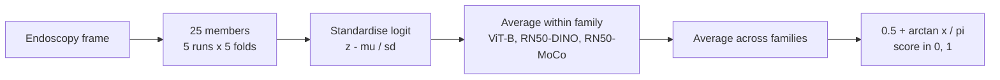

<h1 align="center">
<strong>AFA-LoRA: Amplified Fold-Averaged Low-Rank Adaptation for Barrett's Neoplasia Detection</strong>
</h1>

<div align="center">

<a href="https://git.io/typing-svg">

</a>

[](#-overview)
[](https://huggingface.co/adidukre/AFA-LoRA)
[](#-method)
[](LICENSE)
[](https://visitorbadge.io/status?path=https%3A%2F%2Fgithub.com%2Fadinathdukre%2FAFA-LoRA)

<h3>🤗 <a href="https://huggingface.co/adidukre/AFA-LoRA">Weights</a> &nbsp;|&nbsp; 🧠 <a href="#-method">Method</a> &nbsp;|&nbsp; ⚡ <a href="#-quick-start">Quick Start</a></h3>

**Team GenMI**


</div>

## 🔥 News
- **[01 Oct 2026]** 🚀 Training code, the Grand Challenge inference container and the released weights for our RARE 2026 submission are public.

## Overview
**AFA-LoRA** is an ensemble for **frame-level detection of neoplasia in Barrett's oesophagus**, submitted by Team GenMI to the **RARE 2026 challenge (MICCAI 2026)**. It combines 25 binary frame classifiers initialised from the public **GastroNet-5M** self-supervised checkpoints, applies two weight-space transforms to the LoRA adapters when they are merged, and fuses the members' logits so that every encoder family has an equal say.



## 📖 Contents
- [🧠 Method](#-method)
- [⛏️ Installation](#️-installation)
- [⚡ Quick Start](#-quick-start)
- [🐳 Grand Challenge Container](#-grand-challenge-container)
- [🏋️ Training from Scratch](#️-training-from-scratch)
- [🧪 Tests](#-tests)
- [🗂️ Repository Layout](#️-repository-layout)
- [📨 Contact](#-contact)
- [📜 License](#-license)

## 🧠 Method

Each member is a timm encoder with a linear head on the pooled feature vector.

| Run | Encoder | Input | Adaptation | Family |
|---|---|:---:|---|---|
| `vitb_aug_strong` | DINOv2 ViT-B/14, 4 registers | 336×336 | LoRA r16, alpha 16 | `dinov2_vitb` |
| `vitb_aug_base` | DINOv2 ViT-B/14, 4 registers | 336×336 | LoRA r16, alpha 16 | `dinov2_vitb` |
| `vitb_aug_light` | DINOv2 ViT-B/14, 4 registers | 336×336 | LoRA r16, alpha 16 | `dinov2_vitb` |
| `resnet50_dino` | ResNet-50 (DINO) | 384×384 | full fine-tune | `resnet50_dino` |
| `resnet50_mocov2` | ResNet-50 (MoCo v2) | 384×384 | full fine-tune | `resnet50_mocov2` |

Each run is trained on five grouped, label-stratified cross-validation folds, and every fold is one ensemble member. The three ViT runs differ only in augmentation strength.

**Two adapter transforms, applied at merge time with no inference cost:**

1. **Amplification.** The merged low-rank delta is scaled by 1.5.
2. **Fold averaging.** Each run's low-rank delta is replaced by its mean over the five folds. Normalisation layers and the head stay fold-specific.

**Family-balanced logit fusion.** Each member's logit `z` is standardised as `(z - mu) / sd`, with `mu` and `sd` measured on clean out-of-fold predictions. Standardised logits are averaged within each family, then across the three families, and mapped to (0, 1) by `0.5 + arctan(x) / pi`.

> [!TIP]
> Members are stored round-robin across families, so if the container stops early to meet the time limit, every family still contributes.

## ⛏️ Installation

```bash
git clone https://github.com/adinathdukre/AFA-LoRA
cd AFA-LoRA
pip install -r requirements.txt
```

## ⚡ Quick Start

Download the released weights:

```bash
pip install huggingface_hub
huggingface-cli download adidukre/AFA-LoRA --local-dir /path/to/AFA-LoRA-weights
```

Score a batch of frames:

```python
import sys

import numpy as np
import torch

sys.path.insert(0, "submission")
from ensemble import RareEnsemble

ensemble = RareEnsemble.from_directory("/path/to/AFA-LoRA-weights", torch.device("cuda"))
images = np.zeros((4, 512, 640, 3), dtype=np.uint8)
scores = ensemble.predict(images, batch_size=32)
```

`images` is a stack of uint8 RGB frames of shape (N, H, W, 3). Frames are resized to each member's input size without cropping.

> [!NOTE]
> The output is a ranking score in (0, 1), not a calibrated probability.

## 🐳 Grand Challenge Container

```bash
cd submission
MODEL_DIR=/path/to/AFA-LoRA-weights INPUT_DIR=/path/to/test/input ./do_test_run.sh
MODEL_DIR=/path/to/AFA-LoRA-weights OUT_DIR=/path/to/artifacts ./do_save.sh
```

`do_save.sh` writes the image and the weights as two tarballs. The weights are mounted at `/opt/ml/model`.

| Variable | Meaning | Default |
|---|---|---|
| `RARE_TIME_BUDGET` | time budget in seconds | 1100 |
| `RARE_BATCH_SIZE` | inference batch size | 32 |

## 🏋️ Training from Scratch

<details open>
<summary><strong>Data and checkpoints</strong></summary>

The RARE training release is expected as:

```text
/path/to/RARE/labeled/<center>/{ndbe,neo}/*.png
```

Set `data.root` in `configs/base.yaml` to that directory. Download the GastroNet-5M checkpoints `dinov2.pth`, `RN50_GastroNet-5M_DINOv1.pth` and `RN50_GastroNet-5M_MOCOv2.pth` into one directory and point `GASTRONET_DIR` at it:

```bash
export GASTRONET_DIR=/path/to/gastronet
```

</details>

**1. Splits.** Cluster near-duplicate frames by perceptual hash and write `data/manifest.csv` with five grouped folds:

```bash
python scripts/make_splits.py
```

**2. Training.** Train one fold of one run:

```bash
python scripts/train.py --config configs/exp/vitb_aug_strong.yaml --fold 0 --device cuda:0
```

Or train all 25 members, one process per listed GPU:

```bash
GPUS="0 1 2 3" bash scripts/retrain_final.sh
```

Each fold writes `runs/<run>/fold_<k>/`. The member weights are `swa.pt`, the average of the last three epochs.

**3. Clean out-of-fold scores.** Score each fold's validation images without augmentation, using the merged weights (alpha scale 1.5, fold averaging):

```bash
python scripts/score_folds_clean.py \
    --runs runs/vitb_aug_strong runs/vitb_aug_base runs/vitb_aug_light \
           runs/resnet50_dino runs/resnet50_mocov2
```

**4. Export.** Merge the adapters, write one `model.safetensors` per member and write `ensemble.json`, which holds the standardisation constants and the member order:

```bash
python scripts/export_submission.py \
    --runs runs/vitb_aug_strong runs/vitb_aug_base runs/vitb_aug_light \
           runs/resnet50_dino runs/resnet50_mocov2 \
    --out submission/model
```

> [!IMPORTANT]
> The order of `--runs` sets the order of members within a family.

## 🧪 Tests

```bash
python -m pytest tests -q
```

## 🗂️ Repository Layout

```text
AFA-LoRA/
├── configs/     # base configuration and one file per training run
├── rare/        # data, augmentation, model, training loop, metric, LoRA merge
├── scripts/     # splits, training, clean scoring, export
├── submission/  # Grand Challenge inference container
└── tests/       # metric, container parity, LoRA merge and deadline tests
```

## 📨 Contact
For questions or collaboration, please open an [issue](https://github.com/adinathdukre/AFA-LoRA/issues) or reach out to [Adinath Madhavrao Dukre](https://github.com/adinathdukre).

## 📜 License

This project is licensed under the MIT License. See the [LICENSE](LICENSE) file for details.

> [!IMPORTANT]
> AFA-LoRA is intended for research only. It is not approved for clinical use and must not inform any diagnostic or treatment decision.
